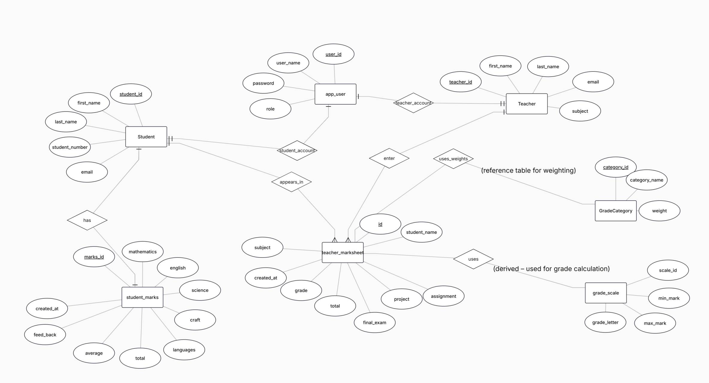

# ClassIQ – Teacher  Grade Book and Report Card System

## Project Overview

ClassIQ is a Java-based application developed to help teachers to manage student academic records.
The system allows teachers to view student information, record marks, and generate report cards and giving feed back according students' perfomances in an organized way.
>Furthermore students can see their grades and how is the base of their grades and download their own report card
 The goal of this project is to demonstrate software development concepts and modern development tools.

---

## Features

* Manage student information
* Display grading criteria
* View student grades
* Generate report cards
* Teacher dashboard interface
* Grant feed backs

---

## Technologies Used


* **JavaFX** for the user interface
* **Maven** for project build management
* **MariaDB / Heidy SQL for Database**
* **JUnit** for testing
* **Jenkins** for Continuous Integration
* **Docker** for containerization
* **GitHub** for version control

---

## Project Structure

```
ClassIQ
│
├── src/main        → Main application source code
├── src/test        → Unit tests
├── target          → Compiled project files
├── Dockerfile      → Docker configuration
├── Jenkins file     → Jenkins automation pipeline
├── pom.xml         → Maven configuration
└── README.md       → Project documentation
```

---

## Software Development Methodologies

This project includes a flowchart that illustrates three software development methodologies: **SDLC ,Agile, and DevOps**. These methodologies show different approaches to building and maintaining software systems.

### Methodology Overview

| Methodology | Description                                                                                                                                                               |
| ----------- | ------------------------------------------------------------------------------------------------------------------------------------------------------------------------- |
| **SDLC**    | The process that step by step moves such as requirement analysis, system design, implementation, testing, deployment, and maintenance. |
| **Agile**   | An method which work is completed in short cycles called sprints. Each sprint includes planning, development, testing, and review.                  |
| **DevOps**  | A modern approach that integrates development and operations with continuous integration, testing, delivery, and monitoring.                                              |

## Use Case Diagram
The use case diagram shows how users interact with the system.
.jpeg)

## ER Diagram


## GitHub Repository
https://github.com/Tharushika78910/ClassIQ.git

## Trello board link
https://trello.com/b/uLfnPk8H/product-description-goal


---

## How to Run the Project

1. Clone the repository from GitHub.
2. Open the project in IntelliJ IDEA.
3. Build the project using Maven.

```
mvn clean install
```

4. Run the main Java application file.

---

## Docker Usage

Build the Docker image:

```
docker build -t classIq-app .
```

Run the container:

```
docker run classIq-app
```

---

## Author

Group 2 -
Software Engineering Project 1 TX00EY27-3011
